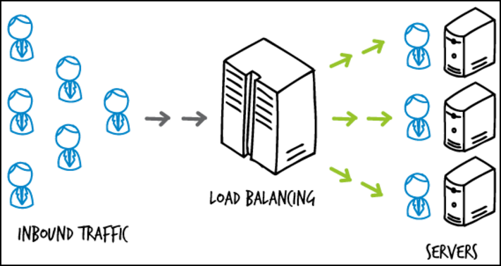

# 1. 로드 밸런싱이란?

- 하나의 서버로는 모든 트래픽을 감당하기 어려워 여러 서버에 트래픽을 분산하여주는 방법이다.

- 서비스의 규모가 커지고 이용자 수가 증가하면 원활한 서비스 동작이 불가능하여 아래의 대처 방법들을 사용해야 한다.
    - 기존의 서버 성능을 확장하는 Scale-up 방식
    - 기존의 서버와 동일하거나 낮은 성능의 서버를 증설하는 Scale-out 방식

  → 여기서 Scale-out방식을 사용한다면 로드 밸런싱 기술이 반드시 필요하다.

- L4로드 밸런싱과 L7로드 밸런싱이 대표적이다.

# 2. 로드 밸런싱 기법

로드 밸런싱 기법은 서버의 능력을 고려하여 분배하여야 하기 때문에 서버의 상황에 맞춰서 적절한 방법을 사용해야 한다.

## 2.1. 라운드로빈 방식(Round Robin Method)

- 서버에 들어온 요청을 순서대로 돌아가며 배정하는 방식이다.
- 클라이언트의 요청을 순서대로 분배하기 때문에 여러 대의 서버가 동일한 스펙을 갖고 있고, 서버와의 연결(세션)이 오래 지속되지 않는 경우에 활용하기 적합하다.

## 2.2. 가중 라운드로빈 방식(Weighted Round Robin Method)

- 각각의 서버마다 가중치를 매기고 가중치가 높은 서버에 클라이언트 요청을 우선적으로 배분한다.
- 주로 서버의 트래픽 처리 능력이 상이한 경우 사용되는 부하 분산 방식이다.
- 예를 들어 A라는 서버가 5라는 가중치를 갖고 B라는 서버가 2라는 가중치를 갖는다면, 로드 밸런서는 라운드로빈 방식으로 A 서버에 5개 B 서버에 2개의 요청을 전달한다.

## 2.3. IP 해시 방식(IP Hash Method)

- 클라이언트의 IP 주소를 특정 서버로 매핑하여 요청을 처리하는 방식이다.
- 사용자의 IP를 해싱하여 로드를 분배하기 때문에 사용자가 항상 동일한 서버로 연결되는 것을 보장한다.

## 2.4. 최소 연결 방식(Least Connection Method)

- 요청이 들어온 시점에 가장 적은 연결상태를 보이는 서버에 우선적으로 트래픽을 배분한다.
- 자주 세션이 길어지거나, 서버에 분배된 트래픽들이 일정하지 않은 경우에 적합한 방식이다.

## 2.5. 최소 응답 시간 방식(Least Response Time Method)

- 서버의 현재 연결 상태와 응답 시간(Response Time, 서버에 요청을 보내고 최초 응답을 받을 때까지 소요되는 시간)을 모두 고려하여 트래픽을 배분한다.
- 가장 적은 연결 상태와 가장 짧은 응답 시간을 보이는 서버에 우선적으로 로드를 배분하는 방식이다.

# 3. L4, L7 로드 밸런싱

## 3.1. L4 로드 밸런싱

- Layer 4인 전송 계층에서 동작하는 로드 밸런서로 네트워크 계층(IP, IPX)이나 전송 계층(TCP, UDP)의 정보(IP주소, 포트번호, MAC주소, 전송 프로토콜)를 바탕으로 로드를 분산한다.
- 데이터의 안을 들여다보지 않고 패킷 레벨에서 로드를 분산하기에 속도가 빠르고 효율이 높다.
- 데이터의 내용을 복호화할 필요가 없기에 안전하다.
- L7보다 가격이 저렴하다.
- 패킷의 내용을 살펴볼 수 없기에 섬세한 라우팅이 불가능하고 사용자의 IP가 바뀌면 연속적인 서비스를 제공하기 어렵다는 단점이 있다.

## 3.2. L7 로드 밸런싱

- Layer 7인 응용 계층에서 동작하는 로드 밸런서로 애플리케이션 계층(HTTP, FTP, SMTP)에서 로드를 분산하기 때문에 HTTP 헤더, 쿠키 등과 같은 사용자의 요청을 기준으로 특정 서버에 트래픽을 분산하는 것이 가능하다.
    - TCP/ UDP정보 뿐만 아니라 HTTP의 URI, FTP의 파일명, 쿠키 정보 등을 바탕으로 한다.
    - 패킷의 내용을 확인하고 해당 내용에 따라 로드를 특정 서버에 분배하는 것이 가능하다.
- 상위 계층에서 로드를 분산하기에 섬세한 라우팅이 가능하다.
    - URl에 따라 부하를 분산시키거나, HTTP 헤더의 쿠키 값에 따라 부하를 분산하는 등의 클라이언트의 요청을 세분화하여 서버에 전달할 수 있다.
- 캐싱 기능을 제공한다.
- 비정상적인 트래픽을 필터링해 서비스의 안정성이 높다.
    - DoS/DDoS와 같은 비정상적인 트래픽을 필터링할 수 있어 네트워크 보안 분야에서도 활용되고 있다.
- 패킷의 내용을 복호화하기에 L4보다 더 많은 비용을 지불해야하며 클라이언트가 로드 밸런서와 인증서를 공유하기 때문에 공격자가 로드 밸런서를 통해 클라이언트의 데이터에 접근할 위험성이 있다는 단점이 있다.

# 질문
- L4, L7에서 수행하는 로드 밸런싱의 차이는 무엇이 있을까?
- 서버 과부하시 Scale-up보다 Scale-out이 갖는 이점은 무엇이 있을까?

# 참조
[로드 밸런싱에 대해 알아보자!](https://tecoble.techcourse.co.kr/post/2021-11-07-load-balancing/)
